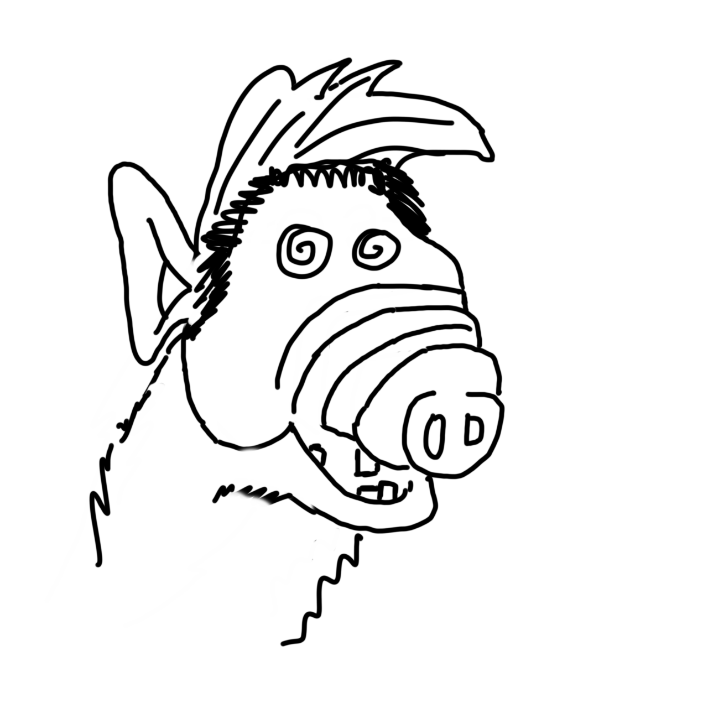
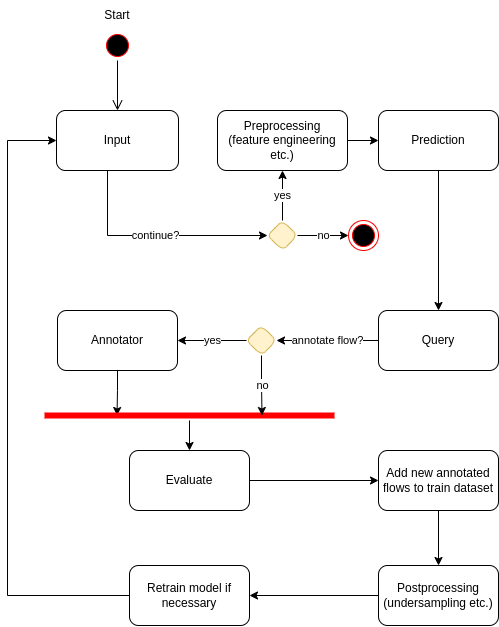
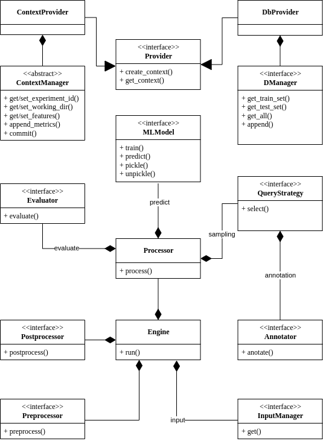

# ALF - Active Learning Framework

## Outline

* [About project](#about-project)
* [Architecture](#architecture)

## About project
Recent network traffic classification methods benefit from machine learning (ML) technology. However, there are many challenges due to use of ML, such as: lack of high-quality annotated datasets, data-drifts and other effects causing aging of datasets and ML models, high volumes of network traffic etc. We presents a novel Active Learning Framework (ALF) to address this topic. ALF provides prepared software components that can be used to deploy an active learning loop and maintain an ALF instance that continuously evolves a dataset and ML model automatically. The resulting solution is deployable for **IP flow-based** analysis of high-speed (100\,Gb/s) networks, and also **supports research experiments** on different strategies and methods for annotation, evaluation, dataset optimization, etc.

<p align="center">

</p>

---

## Architecture

ALF implements Active Learning Loop. Using activity diagram we visualize a design of ALF. It basically implements Active Learning loop so we can define ALF as AL core + input interface + preprocessing and postprocessing steps + evaluation.

<p align="center">

</p>

Bellow we can see how ALF is implemented using class diagram. Note that we used simplified class diagram to simplify the implementation by ommiting inheritance. 

<p align="center">

</p>

## Use

Install all dependencies:

```
make init
```

There are 4 main dependencies:
* Python 3.10
* essential: `requirements.txt`
* developers: `requirements-dev.txt`
* NEMEA: `requirements-nemea.txt`

NEMEA dependencies are necessary for ALF to cooperate with [NEMEA framework](https://github.com/CESNET/Nemea). For now, we assume using NEMEA in tests and quick start. In the future we will remove this dependency.

## Quick start

* Tests, linting, documentation:
```
make test # unit testy
make lint # linter
firefox docs/_build/html/index.html # documentation
```

* Online stream demo:

Terminal 1:
```
mkdir workdir

python nemea_module_doh.py --i u:alf_socket --id test_random --workdir ./workdir --model single --query_strategy random --blacklist conf/blacklist.txt --query_nmax 1 --max_db_size 10000 --dpath conf/doh_D0.csv
```

Terminal 2:
```
/usr/bin/nemea/traffic_repeater -i "f:example.trapcap,u:alf_socket"
```

Parameter `i` defines NEMEA inferface. See [here](https://github.com/CESNET/Nemea-Modules/tree/c087d9a63f8feb0023e9f6400400450d2474f725/traffic_repeater) for more.

Note: When running `nemea_module_doh.py`, it is waiting for data to arrive on the socket and the program does not respond to the standard `SIGINT` (CTRL-C). You need to either kill the process (`SIGKILL`, `kill -9 $PID`) or send `SIGINT`, then send another stream (like the example) and the first thing it does after the loop continues is terminate (in `Python` `KeyboardInterrupt`). This is a feature of `Python` and its infinite waiting loop in the generator. We are aware of a solution, but since this property does no harm we decided not to address it for now.

## How to create your own application

For simplicity we do not use parameters and all constants are hardcoded.

```python
# logging
import logging
import sys

# use Random Forrest as classifier
from sklearn.ensemble import RandomForestClassifier

# import parts of ALF
import alf.anotator
import alf.context_manager
import alf.d_manager
import alf.engine
import alf.evaluator
import alf.input_manager
import alf.ml_model
import alf.postprocess
import alf.preprocess
import alf.query_strategy
```

Frameworks heavy uses `logging` module to log messages. Configure it:

```python
logging.basicConfig(
    stream=sys.stdout,
    format='[%(asctime)s]: %(message)s',
    level=logging.DEBUG
)
```

Now let us to setting up contants and parameters. Usually this is set up by user or by configuration file etc:

```python
# list of features from flows, type: list[str]
DATASET_COLUMNS = ["f1", "f2", ..]
# interface IFC_SPEC defined by NEMEA
IFC = "u:alf_socket"
# id, workdir; id should be unique
EXP_ID = "showcase"
WORKDIR = "/tmp/alf"
# annotator specific:
BLACKLIST = "conf/blacklist.txt"
# D0 is init train dataset
D0 = "conf/doh_train_db_small.csv"
# maximum size of the D_i database
MAX_SIZE = 5000
# query strategy specific:
N = 10
THRESHOLD = 0.1
```

Now we create contexts:

```python
ContextProvider.create_context("file")
ContextProvider.get_context().set_features(DATASET_COLUMNS)
ContextProvider.get_context().set_experiment_id(EXP_ID)
ContextProvider.get_context().set_working_dir(WORKDIR)
DbProvider.create_context(context_type="file", d_0_path=D0)
```

Finally, now define ALF parts:

```python
anotator = alf.anotator.AnotatorDoH(blacklist_path=BLACKLIST)
model = alf.ml_model.SupervisedMLModel(RandomForestClassifier())
query_strategy = alf.query_strategy.UncertanityUnrankedBatch(
    anotator_obj=anotator, max_samples=N,
    score_threshold=THRESHOLD, dry_run=True)
input_manager = alf.input_manager.TrapcapSocketInputManager(
    definition=IFC)
postprocessor = alf.postprocess.PostprocessorUndersample(MAX_SIZE)
```

We have to add parts to `Engine`:

```python
engine = alf.engine.Engine(
    preprocessor=alf.preprocess.PreprocessorDoH(),
    postprocessor=postprocessor,
    ml_model_obj=model,
    query_strategy_obj=query_strategy,
    evaluator_obj=alf.evaluator.EvaluatorTestAnotatedAndAllPredicted(),
    input_manager_obj=input_manager
)
```

Last part - run the machine:

```python
engine.run()
```

## License

BSD

## Further Information

* @jaroslavpesek here on Github
* pesek (at) cesnet.cz or pesekja8 (at) fit.cvut.cz